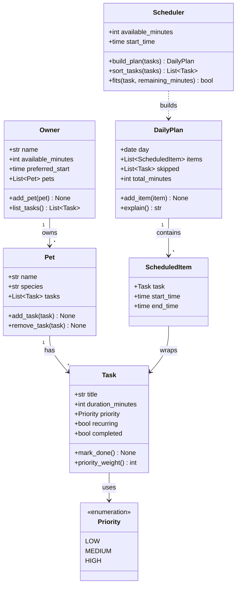

# PawPal+ Project Reflection

## 1. System Design

**Core user actions**

PawPal+ is built around three core actions a pet owner can perform. Together they trace the
natural journey through the app: set things up, add what needs doing, then get a plan back.

1. **Set up the owner and pet profile.** The user enters who they are and which pet they're
   caring for — at minimum the owner's name, the pet's name, and the species — along with any
   care preferences or constraints (for example, how much total time they have in a day, or a
   rule like "no walks after dark"). This profile is the foundation every plan is built for,
   since each schedule is tailored to a specific pet under specific constraints.

2. **Add and manage care tasks.** The user builds a list of care tasks, giving each one a
   title, a duration in minutes, and a priority (low, medium, or high) — for example,
   "Morning walk, 20 minutes, high." They can also edit or remove tasks as their needs change.
   These tasks are the raw material the scheduler works with, and their duration and priority
   are exactly the information it needs to decide what fits and in what order.

3. **Generate and view today's plan.** The user asks PawPal+ to build a daily schedule. The
   app selects and orders the tasks so they fit within the available time, then displays the
   resulting plan clearly and explains its reasoning — why each task was included and when it
   was placed. This is the payoff of the whole app: turning a loose list of tasks into a
   concrete, justified plan for the day.

**Class diagram (draft UML)**

The three actions map onto a small set of classes: `Owner` and `Pet` capture the profile,
`Task` (with a `Priority`) captures what needs doing, and `Scheduler` turns a list of tasks
into a `DailyPlan` made of `ScheduledItem`s.

**How the diagram supports each action**

- *Set up profile* → `Owner` and `Pet` hold the owner/pet info and the day's constraints
  (`available_minutes`, `preferred_start`).
- *Add and manage tasks* → `Pet.add_task` / `remove_task` manage a list of `Task`s, each
  carrying the `duration_minutes` and `Priority` the scheduler reasons over.
- *Generate and view the plan* → `Scheduler.build_plan` sorts and fits tasks into a
  `DailyPlan` of timed `ScheduledItem`s, and `DailyPlan.explain` produces the reasoning shown
  to the user.

---

**a. Initial design**

- Briefly describe your initial UML design.
- What classes did you include, and what responsibilities did you assign to each?

**b. Design changes**

- Did your design change during implementation?
- If yes, describe at least one change and why you made it.

---

## 2. Scheduling Logic and Tradeoffs

**a. Constraints and priorities**

- What constraints does your scheduler consider (for example: time, priority, preferences)?
- How did you decide which constraints mattered most?

**b. Tradeoffs**

- Describe one tradeoff your scheduler makes.
- Why is that tradeoff reasonable for this scenario?

---

## 3. AI Collaboration

**a. How you used AI**

- How did you use AI tools during this project (for example: design brainstorming, debugging, refactoring)?
- What kinds of prompts or questions were most helpful?

**b. Judgment and verification**

- Describe one moment where you did not accept an AI suggestion as-is.
- How did you evaluate or verify what the AI suggested?

---

## 4. Testing and Verification

**a. What you tested**

- What behaviors did you test?
- Why were these tests important?

**b. Confidence**

- How confident are you that your scheduler works correctly?
- What edge cases would you test next if you had more time?

---

## 5. Reflection

**a. What went well**

- What part of this project are you most satisfied with?

**b. What you would improve**

- If you had another iteration, what would you improve or redesign?

**c. Key takeaway**

- What is one important thing you learned about designing systems or working with AI on this project?
