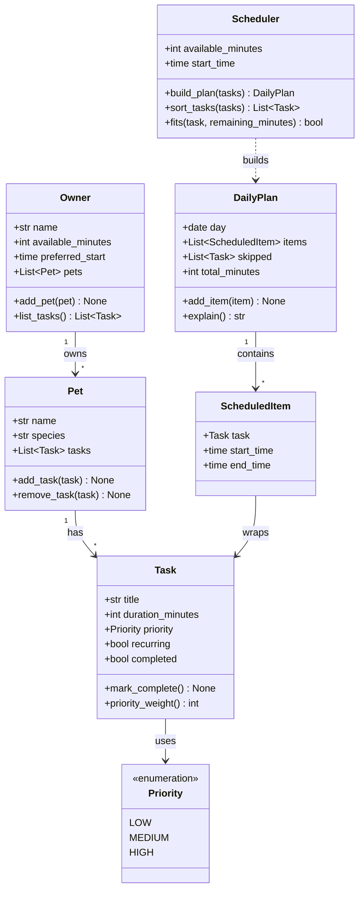

# PawPal+ Project Reflection

## 1. System Design

**Core user actions**

PawPal+ is built around three core actions a pet owner can perform. Together they trace the
natural journey through the app: set things up, add what needs doing, then get a plan back.

1. **Set up the owner and pet profile.** The user enters who they are and which pet they're
   caring for — at minimum the owner's name, the pet's name, and the species — along with any
   care preferences or constraints (for example, how much total time they have in a day, or a
   rule like "no walks after dark"). This profile is the foundation every plan is built for,
   since each schedule is tailored to a specific pet under specific constraints.

2. **Add and manage care tasks.** The user builds a list of care tasks, giving each one a
   title, a duration in minutes, and a priority (low, medium, or high) — for example,
   "Morning walk, 20 minutes, high." They can also edit or remove tasks as their needs change.
   These tasks are the raw material the scheduler works with, and their duration and priority
   are exactly the information it needs to decide what fits and in what order.

3. **Generate and view today's plan.** The user asks PawPal+ to build a daily schedule. The
   app selects and orders the tasks so they fit within the available time, then displays the
   resulting plan clearly and explains its reasoning — why each task was included and when it
   was placed. This is the payoff of the whole app: turning a loose list of tasks into a
   concrete, justified plan for the day.

**Class diagram (draft UML)**

The three actions map onto a small set of classes: `Owner` and `Pet` capture the profile,
`Task` (with a `Priority`) captures what needs doing, and `Scheduler` turns a list of tasks
into a `DailyPlan` made of `ScheduledItem`s.

**How the diagram supports each action**

- *Set up profile* → `Owner` and `Pet` hold the owner/pet info and the day's constraints
  (`available_minutes`, `preferred_start`).
- *Add and manage tasks* → `Pet.add_task` / `remove_task` manage a list of `Task`s, each
  carrying the `duration_minutes` and `Priority` the scheduler reasons over.
- *Generate and view the plan* → `Scheduler.build_plan` sorts and fits tasks into a
  `DailyPlan` of timed `ScheduledItem`s, and `DailyPlan.explain` produces the reasoning shown
  to the user.

---

**a. Initial design**

My initial UML design (see `design.mmd`) splits the system into small classes, each with a
single clear responsibility, grouped into "data" classes that hold information and a "behavior"
class that does the scheduling work.

- **`Owner`** — represents the pet owner and the day's constraints. It holds the owner's name,
  how many minutes they have available (`available_minutes`), and when their day starts
  (`preferred_start`), plus the list of pets they own. Its job is to be the entry point to a
  user's data and to expose all of their tasks across pets (`list_tasks`).

- **`Pet`** — represents a single pet (name and species) and owns that pet's list of care
  tasks. Its responsibility is managing that list: adding and removing tasks (`add_task`,
  `remove_task`). I kept tasks on the pet rather than the owner so an owner can have several
  pets without their tasks getting mixed together.

- **`Task`** — represents one unit of care work, such as a 20-minute walk. It carries the
  title, `duration_minutes`, a `priority`, and flags for whether it is `recurring` or already
  `completed`. It is responsible for knowing its own state (`mark_complete`) and reporting how
  important it is for sorting (`priority_weight`).

- **`Priority`** — a small enumeration (LOW, MEDIUM, HIGH) so priority is a fixed set of values
  instead of free-form strings. I made it an `IntEnum` so tasks can be compared and sorted by
  importance directly.

- **`Scheduler`** — the one behavior class and the heart of the system. It holds the
  constraints it must respect (`available_minutes`, `start_time`) and is responsible for
  turning a list of tasks into a plan: ordering them (`sort_tasks`), checking whether a task
  still fits in the remaining time (`fits`), and assembling the final result (`build_plan`).
  I deliberately separated this logic from the data classes so the scheduling rules live in
  one place and are easy to test on their own.

- **`DailyPlan`** — represents the scheduler's output for one day. It holds the chosen,
  time-stamped items, the tasks that had to be skipped, and the total scheduled minutes. Its
  responsibilities are collecting items (`add_item`) and producing the human-readable
  reasoning the app shows the user (`explain`).

- **`ScheduledItem`** — a small wrapper pairing a `Task` with the concrete `start_time` and
  `end_time` it was placed at. It exists so a `DailyPlan` can describe *when* each task happens
  without changing the `Task` itself.

The relationships follow the natural ownership chain: an `Owner` has many `Pet`s, a `Pet` has
many `Task`s, and each `Task` has a `Priority`. The `Scheduler` consumes tasks and produces a
`DailyPlan`, which is made up of `ScheduledItem`s that each wrap a `Task`.

**b. Design changes**

Yes. After building the skeleton I had it reviewed for missing relationships and weak spots,
and the feedback led to four concrete changes to the design.

1. **Gave `Task` a stable `id`.** Originally tasks were identified only by their fields, but
   because `Task` is a dataclass, two different tasks with the same title, duration, and
   priority counted as *equal*. That made "remove this task" and "edit this task" unsafe — the
   wrong one could be deleted. I added an auto-generated `id` field so every task is uniquely
   identifiable. This directly supports the "add/edit/remove tasks" user action.

2. **Replaced the `recurring` bool with a `Recurrence` enum (NONE / DAILY / WEEKLY).** A plain
   boolean could only say *whether* a task repeats, not *how often*. Since the scenario calls
   out daily vs. weekly tasks, an enum lets the scheduler eventually treat them differently.
   This mirrors the choice I already made for `Priority`.

3. **Added a `preferred_time` to `Task`.** The first design assumed the scheduler could place
   every task back-to-back from the start of the day. But real care has fixed-time events
   (medication at 9:00, dinner at 18:00). Without a time on the task, there was nothing for
   "conflict handling / overlapping slots" to even work with. `preferred_time` is optional, so
   flexible tasks still float and only pinned tasks are anchored.

4. **Removed the duplicated constraints from `Scheduler` and read them from the `Owner`.**
   Initially both `Owner` and `Scheduler` stored `available_minutes` and the start time, which
   meant they could drift out of sync if the owner edited their availability. I changed
   `build_plan` to take the `Owner` and pull the task list and constraints from it, giving a
   single source of truth and a cleaner relationship (`Scheduler ..> Owner`).

I also dropped the `priority_weight()` method, since `Priority` is already an `IntEnum` and can
be sorted directly — the extra method was a second, redundant way to express the same ordering.

I initially chose **not** to add a back-reference from `Task` to its `Pet`, to avoid circular
references in the data classes. I later reversed that decision when I added recurring tasks:
for a completed daily/weekly task to create its next occurrence on the correct pet, the task
has to know which pet owns it. I added a `pet` field that `Pet.add_task` sets, and excluded it
from the dataclass `repr` and equality (`repr=False, compare=False`) so it cannot cause the
infinite recursion I had originally been worried about. `Task.next_occurrence()` builds the
fresh copy and `Task.mark_complete()` appends it via that back-reference. The UML in
`design.mmd` was updated to match all of the changes above.

---

## 2. Scheduling Logic and Tradeoffs

**a. Constraints and priorities**

- What constraints does your scheduler consider (for example: time, priority, preferences)?
- How did you decide which constraints mattered most?

**b. Tradeoffs**

The main tradeoff is that the scheduler is **greedy** and treats the day as one continuous
block. It sorts tasks by priority (then shortest first) and packs them back-to-back from the
owner's start time, taking each task while time remains and skipping the rest. This has two
consequences:

- It **does not honor each task's `preferred_time`** and does not detect overlapping time
  slots. A task pinned to 18:00 may be placed at 08:55 instead. The plan is an ordered,
  budget-respecting *to-do list* rather than a true clock-accurate calendar.
- Being greedy, it is **not guaranteed to be optimal**. One long high-priority task can consume
  most of the budget and crowd out several shorter tasks that, together, might have been more
  valuable. (Finding the truly optimal set is a knapsack-style problem.)

This tradeoff is reasonable for the scenario. The user is a busy pet owner who wants a plan they
can actually follow, and "do the most important things first, fit in what you can, and clearly
list what got skipped" is intuitive and easy to trust — especially because the scheduler can
*explain* its choices (`DailyPlan.explain`). The greedy approach is also simple (O(n log n),
dominated by the sort) and fast for the handful of tasks a pet needs each day. Honoring fixed
times and overlap detection would turn this into interval scheduling — noticeably more code and
more ways to fail — for little practical benefit at this scale. I kept `sort_by_time` and the
`preferred_time` field available so that time-aware placement can be added later without
redesigning the data model.

---

## 3. AI Collaboration

**a. How you used AI**

- How did you use AI tools during this project (for example: design brainstorming, debugging, refactoring)?
- What kinds of prompts or questions were most helpful?

**b. Judgment and verification**

- Describe one moment where you did not accept an AI suggestion as-is.
- How did you evaluate or verify what the AI suggested?

---

## 4. Testing and Verification

**a. What you tested**

- What behaviors did you test?
- Why were these tests important?

**b. Confidence**

- How confident are you that your scheduler works correctly?
- What edge cases would you test next if you had more time?

---

## 5. Reflection

**a. What went well**

- What part of this project are you most satisfied with?

**b. What you would improve**

- If you had another iteration, what would you improve or redesign?

**c. Key takeaway**

- What is one important thing you learned about designing systems or working with AI on this project?
